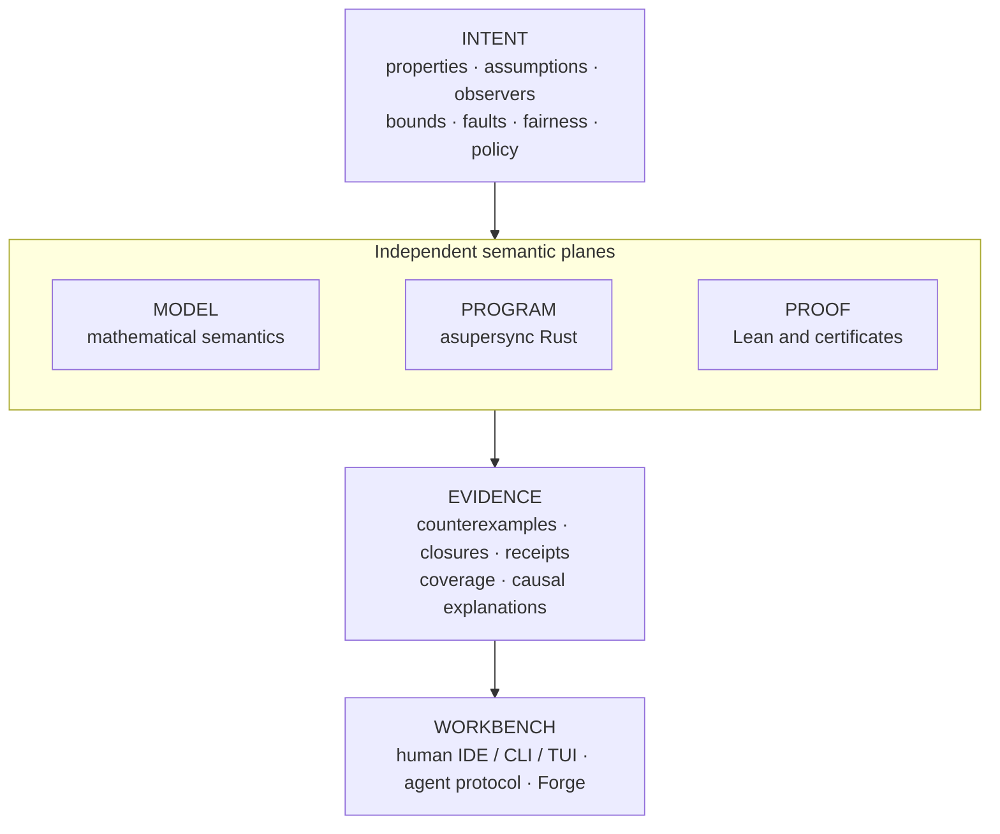

# Continuum

_An intent-preserving verification workbench for concurrent and distributed Rust._

Continuum is an attempt to make the shortest trustworthy path from an engineering
claim to a working system: state the intent, model the behavior, exercise the real
program, inspect causal evidence, repair what failed, and independently check what
was proved.

> [!IMPORTANT]
> Continuum is currently in the **design and executable-spike phase**. This
> repository contains the Revision 3 architecture dossier, schemas, examples,
> reference experiments, and a draft Lean formalization. The production Rust
> crates, `continuumd`, and the commands shown below are planned—not yet released.

## The idea

Formal models, deterministic simulation, systematic concurrency testing, proof,
and production traces usually live in separate worlds. Continuum is designed to
put them behind one explicit semantic contract:



The protected **Intent Contract** is the center of the design. An automated
repair cannot quietly make a result green by weakening a property, strengthening
an assumption, shrinking a bound, hiding an event, removing a fault, or
downgrading the required assurance. Those are legitimate design changes only
when surfaced as explicit semantic diffs.

## What makes Continuum different

- **Causal counterexamples, not log dumps.** Failures are reduced to replayable
  causal cores, mapped back to source and model actions, and contrasted with a
  nearby safe execution.
- **Repairs are transactions.** A proposed change must preserve intent, replay
  the failure, survive neighboring schedules and mutation challenges, and
  rebuild affected proof and refinement evidence.
- **Assurance is an envelope, not a green badge.** Observed, sampled, bounded,
  independently validated, proved, refuted, and inconclusive results retain
  their assumptions, bounds, coverage, epochs, and trusted components.
- **Agents get a real protocol.** Immutable snapshots, explicit handles,
  bounded Context Packs, typed errors, resumable tasks, and authority-separated
  promotion replace terminal scraping and hidden session state.
- **The model, program, and proof remain independently meaningful.** Search
  engines produce evidence; separate checkers decide what that evidence earns.
- **Forge searches for designs under proof constraints.** Candidate algorithms,
  invariants, abstractions, rankings, and implementations are explored without
  letting the generator certify its own work.

## The target experience

A planned first-run workflow is deliberately small:

```bash
cargo continuum init
cargo continuum check
```

A failure should explain the semantic problem before exposing engine internals:

```text
FAIL  AckImpliesDurable

Ack became observable before the corresponding write became durable.
Causal core: 4 events · 2 tasks · 1 cancellation
Abstract mismatch: acked +1, durable unchanged

replay   cp_7m3...
debug    continuum debug cp_7m3...
explain  continuum explain cp_7m3... --level causal
```

The same workbench is intended to support design before code:

```bash
continuum model new lease-service
continuum model check lease-service --property no-overlapping-valid-leases
continuum forge lease-service --holes quorum,renewal_guard
```

And proof-gated repair:

```bash
continuum repair begin cp_7m3...
continuum repair apply --patch patch.diff --hypothesis "publish only after sync"
continuum repair evaluate rt_2c...
continuum repair promote rt_2c...
```

Every meaningful operation follows one interaction contract:

```text
(snapshot, intent, operation, budget, policy)
    → result + evidence + new snapshot or continuation
```

No authoritative result depends on an ambient shell, chat, solver, or daemon
session.

## Planned product surfaces

| Surface | Role |
|---|---|
| `continuumd` | Authoritative snapshot, query, task, and evidence daemon |
| `continuum` / `cargo continuum` | Concise human and Rust-project entry points |
| Continuum LSP | Authoring, semantic navigation, correspondence, and diagnostics |
| Continuum DAP | Causal and time-travel verification debugger |
| Native agent protocol + MCP adapter | Typed, bounded operations over explicit handles |
| SARIF exporter | CI and code-scanning integration |
| Continuum Workbench | Optional local evidence explorer |
| Continuum Forge | Verified synthesis and algorithm discovery |

These are adapters over one native protocol. None owns hidden semantic state.

## What exists today

The current dossier provides:

- a Revision 3 master architecture and an ordered first 30 pull requests;
- 53 architecture decisions and 40 implementable RFCs;
- JSON Schemas and fixtures for intent, snapshots, evidence, repair, synthesis,
  semantic diffs, and agent tasks;
- eight executable Revision 3 spike groups covering causal Context Packs, intent
  diffs, explicit task state, finite CEGIS, incrementality, causal debugging,
  proof-oriented lenses, and multi-agent evidence;
- a pinned 80-family TLA+ Examples compatibility program;
- draft Lean 4 semantics and certificate modules;
- release gates, falsification criteria, benchmarks, and explicit kill criteria.

The dossier validator passes its documented structural checks and spike
assertions. That is evidence for the artifact and several finite design
experiments—not yet evidence of production-scale performance, general
soundness, or a working Rust product. In particular, the Lean sources in this
snapshot have not yet been kernel-checked.

To reproduce the current executable experiments from the dossier root:

```bash
cd notes/plan
python3 spikes/run_r3_spikes.py
python3 tools/validate_dossier.py
```

The validator requires Python 3.11+ and `jsonschema`.

### Deterministic builds

A build that cannot be repeated cannot support a receipt. Plan §20 requires that
"kernel crates build reproducibly from pinned sources" so the "build digest and
toolchain identity" a receipt records (INV-014) stay independently re-derivable,
and `docs/12` §1 makes "Rust edition/toolchain pinned" repository policy. Three
mechanisms carry that in this repository:

- `rust-toolchain.toml` pins the exact patch release, with `rustfmt` and `clippy`
  in the pinned set so a formatting or lint verdict is part of the same identity;
- `Cargo.lock` is committed and every `just` gate runs `--locked`, so a gate can
  never silently re-resolve dependencies (`docs/12` §5, plan §4.2);
- the release profile turns `overflow-checks` on, so the `debug`/`release`
  dimension of the `docs/19` §7 determinism matrix cannot silently change an
  arithmetic result.

Bit-identical binaries are not claimed yet: Cargo's `trim-paths` is still unstable
on the pinned toolchain, so absolute build paths can reach object code. Closing
that gap belongs to the kernel reproducible-build covenant (plan §20, PR 9).

#### Toolchain

`mise.toml` pins the CLI dependencies that sit outside Cargo and Lake: `just`
and `uv` (both from mise's default registry) and `elan` (via the `github`
backend, since elan has no default-registry entry). Rust and Lean are
deliberately not pinned there — Rust stays on rustup + `rust-toolchain.toml`, and
Lean stays on `lean/lean-toolchain` selected by the `elan` mise installs
(mise → elan → pinned toolchain). Bootstrap a fresh checkout with:

```bash
mise install   # installs just, uv, and elan's installer (elan-init)
elan-init -y   # installs elan into ~/.elan and puts it on PATH
just check     # fmt, clippy, tests, boundaries, dossier, Lean build + axiom manifest
```

The second step is not redundant: the pinned elan release asset *is* the
installer, so mise puts `elan-init` on PATH and `elan-init` puts `elan`, `lake`
and `lean` on it. `just lean` (part of `just check`) looks `lake` up on PATH and
never hardcodes an elan location, so either provider works; if it is missing the
recipe says so and names this bootstrap instead of failing cryptically.

## Roadmap

| Phase | Outcome |
|---|---|
| **A — Trust spine** | Immutable workspaces and intent, native protocol, evidence graph, Context Packs, finite reference engine |
| **B — Real-code failure loop** | Asupersync effects, replicated-register wedge, causal debugger, repair transactions |
| **C — Interactive scale** | Incremental semantic database, LSP/DAP/SARIF, clean-build differential auditing |
| **D — Proof and liveness** | Lean pipeline, fairness debugging, invariant/ranking synthesis, refinement receipts |
| **E — Forge** | Typed holes, finite CEGIS, quality-diversity search, independently verified candidates |
| **F — Production and ecosystem** | Production trace evidence, remote workers, corpus parity, public ContinuumBench |

The first complete demonstration is intentionally concrete: find an
acknowledgement-before-durability bug under cancellation, compress a 200-event
run to a four-event causal core, repair it without changing intent, challenge
the repair on neighboring executions, and rebuild independent evidence.

## Read the plan

Start with:

1. [Project dossier](notes/plan/README.md) — the compact map of Revision 3.
2. [Master implementation plan](notes/plan/plan.md) — the complete product and
   engineering program.
3. [Revision 3 architecture](notes/plan/docs/33_REVISION_3_ARCHITECTURE.md) —
   intent, evidence, workbench, and trust boundaries.
4. [Developer experience contract](notes/plan/docs/34_DEVELOPER_EXPERIENCE_PRODUCT_CONTRACT.md)
   — the promises made to human and agent users.
5. [Executable spike report](notes/plan/spikes/R3_SPIKE_REPORT.md) — what has
   actually been exercised and what remains unproved.
6. [Implementation sequence](notes/plan/notes/START_HERE_IMPLEMENTATION.md) —
   the first 30 pull requests and their exit criteria.
7. [Validation report](notes/plan/VALIDATION_REPORT.md) — current checks and
   their boundaries.

## Scope

Continuum does not promise push-button proof of arbitrary Rust, automatic
discovery of the right abstraction, universal liveness automation, exhaustive
unbounded checking, or certainty from incomplete production evidence.

Its narrower promise is ambitious enough: one coherent semantic system,
explicit abstraction and refinement, aggressive but checkable analysis, honest
assurance, and first-class workflows for both developers and coding agents.

## License

Continuum is dual-licensed under [MIT](LICENSE-MIT) or
[Apache-2.0](LICENSE-APACHE), at your option. Contributions are accepted under
the same dual terms.

**One thing to know before you build or ship a Continuum binary.** Continuum's
execution substrate is [asupersync](https://crates.io/crates/asupersync)
([ADR-0001](notes/plan/adr/0001-asupersync-execution-substrate.md)), which is
distributed under `LicenseRef-MIT-OpenAI-Anthropic-Rider` — the MIT license plus
a rider that grants **no rights to OpenAI, L.L.C., Anthropic, PBC, their
affiliates, or anyone acting on their behalf, for their benefit, or under their
direction**, and that requires the rider to travel unmodified with every
distribution of the software or a derivative work.

That rider is not Continuum's to remove, and our MIT/Apache-2.0 grant does not
override it:

- **A build that links asupersync carries the rider to whoever receives it.**
  That includes any release binary, installer, container image, or packaged
  distribution of Continuum's real-code execution path. If you are one of the
  restricted parties named above, the rider withholds the substrate's grant from
  you, and no election of Continuum's own license changes that.
- **A model-only build does not.** Continuum stays capable of model-only
  execution without asupersync (ADR-0001), and its model core is forbidden from
  depending on it, so such a build distributes only first-party code under the
  dual grant plus its other dependencies' ordinary terms.

The project chose to accept this exposure and state it plainly rather than let
recipients discover it inside a dependency license bundle. The reasoning is in
[ADR-0053](notes/plan/adr/0053-product-license-mit-or-apache-2.md) and the
analysis it accepts,
[`LICENSE_DECISION_PACKAGE.md`](notes/plan/notes/LICENSE_DECISION_PACKAGE.md).

None of this is legal advice; the rider's plain terms are quoted above so you can
take your own.
