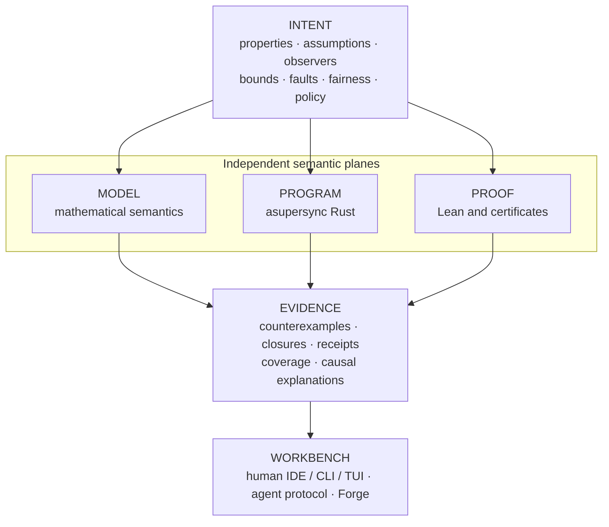

# Continuum

_An intent-preserving verification workbench for concurrent and distributed Rust._

Continuum is an attempt to make the shortest trustworthy path from an engineering
claim to a working system: state the intent, model the behavior, exercise the real
program, inspect causal evidence, repair what failed, and independently check what
was proved.

> [!IMPORTANT]
> Continuum is currently in the **design and executable-spike phase**. This
> repository contains the Revision 3 architecture dossier, schemas, examples,
> reference experiments, and a draft Lean formalization. The production Rust
> crates, `continuumd`, and the commands shown below are planned—not yet released.

## The idea

Formal models, deterministic simulation, systematic concurrency testing, proof,
and production traces usually live in separate worlds. Continuum is designed to
put them behind one explicit semantic contract:



The protected **Intent Contract** is the center of the design. An automated
repair cannot quietly make a result green by weakening a property, strengthening
an assumption, shrinking a bound, hiding an event, removing a fault, or
downgrading the required assurance. Those are legitimate design changes only
when surfaced as explicit semantic diffs.

## What makes Continuum different

- **Causal counterexamples, not log dumps.** Failures are reduced to replayable
  causal cores, mapped back to source and model actions, and contrasted with a
  nearby safe execution.
- **Repairs are transactions.** A proposed change must preserve intent, replay
  the failure, survive neighboring schedules and mutation challenges, and
  rebuild affected proof and refinement evidence.
- **Assurance is an envelope, not a green badge.** Observed, sampled, bounded,
  independently validated, proved, refuted, and inconclusive results retain
  their assumptions, bounds, coverage, epochs, and trusted components.
- **Agents get a real protocol.** Immutable snapshots, explicit handles,
  bounded Context Packs, typed errors, resumable tasks, and authority-separated
  promotion replace terminal scraping and hidden session state.
- **The model, program, and proof remain independently meaningful.** Search
  engines produce evidence; separate checkers decide what that evidence earns.
- **Forge searches for designs under proof constraints.** Candidate algorithms,
  invariants, abstractions, rankings, and implementations are explored without
  letting the generator certify its own work.

## The target experience

A planned first-run workflow is deliberately small:

```bash
cargo continuum init
cargo continuum check
```

A failure should explain the semantic problem before exposing engine internals:

```text
FAIL  AckImpliesDurable

Ack became observable before the corresponding write became durable.
Causal core: 4 events · 2 tasks · 1 cancellation
Abstract mismatch: acked +1, durable unchanged

replay   cp_7m3...
debug    continuum debug cp_7m3...
explain  continuum explain cp_7m3... --level causal
```

The same workbench is intended to support design before code:

```bash
continuum model new lease-service
continuum model check lease-service --property no-overlapping-valid-leases
continuum forge lease-service --holes quorum,renewal_guard
```

And proof-gated repair:

```bash
continuum repair begin cp_7m3...
continuum repair apply --patch patch.diff --hypothesis "publish only after sync"
continuum repair evaluate rt_2c...
continuum repair promote rt_2c...
```

Every meaningful operation follows one interaction contract:

```text
(snapshot, intent, operation, budget, policy)
    → result + evidence + new snapshot or continuation
```

No authoritative result depends on an ambient shell, chat, solver, or daemon
session.

## Planned product surfaces

| Surface | Role |
|---|---|
| `continuumd` | Authoritative snapshot, query, task, and evidence daemon |
| `continuum` / `cargo continuum` | Concise human and Rust-project entry points |
| Continuum LSP | Authoring, semantic navigation, correspondence, and diagnostics |
| Continuum DAP | Causal and time-travel verification debugger |
| Native agent protocol + MCP adapter | Typed, bounded operations over explicit handles |
| SARIF exporter | CI and code-scanning integration |
| Continuum Workbench | Optional local evidence explorer |
| Continuum Forge | Verified synthesis and algorithm discovery |

These are adapters over one native protocol. None owns hidden semantic state.

## What exists today

The current dossier provides:

- a Revision 3 master architecture and an ordered first 30 pull requests;
- 52 architecture decisions and 40 implementable RFCs;
- JSON Schemas and fixtures for intent, snapshots, evidence, repair, synthesis,
  semantic diffs, and agent tasks;
- eight executable Revision 3 spike groups covering causal Context Packs, intent
  diffs, explicit task state, finite CEGIS, incrementality, causal debugging,
  proof-oriented lenses, and multi-agent evidence;
- a pinned 80-family TLA+ Examples compatibility program;
- draft Lean 4 semantics and certificate modules;
- release gates, falsification criteria, benchmarks, and explicit kill criteria.

The dossier validator passes its documented structural checks and spike
assertions. That is evidence for the artifact and several finite design
experiments—not yet evidence of production-scale performance, general
soundness, or a working Rust product. In particular, the Lean sources in this
snapshot have not yet been kernel-checked.

To reproduce the current executable experiments from the dossier root:

```bash
cd notes/plan
python3 spikes/run_r3_spikes.py
python3 tools/validate_dossier.py
```

The validator requires Python 3.11+ and `jsonschema`.

## Roadmap

| Phase | Outcome |
|---|---|
| **A — Trust spine** | Immutable workspaces and intent, native protocol, evidence graph, Context Packs, finite reference engine |
| **B — Real-code failure loop** | Asupersync effects, replicated-register wedge, causal debugger, repair transactions |
| **C — Interactive scale** | Incremental semantic database, LSP/DAP/SARIF, clean-build differential auditing |
| **D — Proof and liveness** | Lean pipeline, fairness debugging, invariant/ranking synthesis, refinement receipts |
| **E — Forge** | Typed holes, finite CEGIS, quality-diversity search, independently verified candidates |
| **F — Production and ecosystem** | Production trace evidence, remote workers, corpus parity, public ContinuumBench |

The first complete demonstration is intentionally concrete: find an
acknowledgement-before-durability bug under cancellation, compress a 200-event
run to a four-event causal core, repair it without changing intent, challenge
the repair on neighboring executions, and rebuild independent evidence.

## Read the plan

Start with:

1. [Project dossier](notes/plan/README.md) — the compact map of Revision 3.
2. [Master implementation plan](notes/plan/plan.md) — the complete product and
   engineering program.
3. [Revision 3 architecture](notes/plan/docs/33_REVISION_3_ARCHITECTURE.md) —
   intent, evidence, workbench, and trust boundaries.
4. [Developer experience contract](notes/plan/docs/34_DEVELOPER_EXPERIENCE_PRODUCT_CONTRACT.md)
   — the promises made to human and agent users.
5. [Executable spike report](notes/plan/spikes/R3_SPIKE_REPORT.md) — what has
   actually been exercised and what remains unproved.
6. [Implementation sequence](notes/plan/notes/START_HERE_IMPLEMENTATION.md) —
   the first 30 pull requests and their exit criteria.
7. [Validation report](notes/plan/VALIDATION_REPORT.md) — current checks and
   their boundaries.

## Scope

Continuum does not promise push-button proof of arbitrary Rust, automatic
discovery of the right abstraction, universal liveness automation, exhaustive
unbounded checking, or certainty from incomplete production evidence.

Its narrower promise is ambitious enough: one coherent semantic system,
explicit abstraction and refinement, aggressive but checkable analysis, honest
assurance, and first-class workflows for both developers and coding agents.
