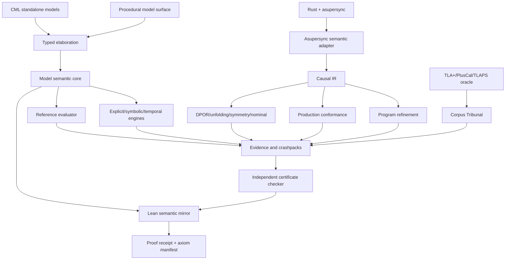

# Continuum Architecture — Revision 2

## 1. Architectural stance

Continuum has six planes joined by typed, versioned contracts:

```text
Authoring → Semantics → Execution → Verification → Evidence
                    ↘ Corpus / Tribunal ↗
```

The three normative artifact families are:

- **CML/core model** — abstract mathematical meaning;
- **CIR/configuration** — concrete causal meaning;
- **proof receipt** — independently checked claim meaning.

No plane owns the others.

## 2. System diagram



## 3. Semantic triptych

### 3.1 Model plane

The model plane contains CML source, typed core, transition/behavior semantics, properties, assumptions, observers and refinement declarations. It exists independently of Rust.

### 3.2 Program plane

The program plane contains asupersync code and versioned domain packs. It emits CIR using public semantic hooks and reports uncovered effects.

### 3.3 Proof plane

The proof plane contains Lean definitions, preservation theorems, reflective certificate checkers, corpus theorem libraries and proof receipts.

### 3.4 Edges

- `ModelPortParity`
- `ModelRefinement`
- `ProgramRefinement`
- `TraceConformance`
- `TransformationPreservation`
- `CertificateJustification`

Each edge records assumptions, observer mapping, semantic epoch and evidence status.

## 4. Stable boundaries

### 4.1 Typed model core

Normative concepts:

- values and equality;
- state schemas;
- init/action relations and frames;
- finite/infinite behaviors;
- enabledness and fairness;
- observers;
- refinement;
- fragment requirements.

The reference evaluator is intentionally independent of optimized engines.

### 4.2 CIR

CIR is append-only within a semantic epoch and contains events, causality, conflict, intervals, effects, resources, obligations, faults, lifecycle and observer projections. It uses canonical binary encoding plus diagnostic JSON.

CIR is the concrete interchange, not the complete abstract model language.

### 4.3 Proof receipt

The receipt binds claim, model/property/assumption closure, semantic/proof/corpus epochs, transformations, certificate, checker, Lean theorems, imports and axioms.

### 4.4 Corpus manifest

A port manifest binds a source family/commit to native modules, configurations, state/action correspondence, expected outcomes, mutations, parity and theorem/runtime evidence.

## 5. Model-language fragments

```text
Finite       exact enumerable semantics
Symbolic     solver-representable constraints
Temporal     infinite behavior and fairness
Probabilistic distributions/MDPs/games
Theorem      Lean-only propositions/proofs
Runtime      concrete controlled effects
WeakMemory   reads-from/coherence execution graphs
Hyper        relational sets of executions
```

Elaboration computes the least required fragment and rejects unsupported backend combinations.

## 6. Asupersync adapter

| Asupersync | Continuum |
|---|---|
| task | task identity and program order |
| region | ownership/lifecycle resource |
| `Cx` | effect authority and provenance |
| cancellation | phase transitions and reason |
| obligation | linear resource delta |
| reserve/commit | effect phase |
| Lab scheduler choice | replay choice |
| virtual time | time constraints |
| chaos | fault event |
| snapshot | replay checkpoint |

The adapter cannot be the sole refinement checker for itself.

## 7. Verification architecture

### 7.1 Reference path

CML core → simple exact evaluator → graph/witness. This path defines executable finite meaning and differential truth.

### 7.2 Optimized paths

- explicit state;
- DPOR/unfolding;
- symbolic/PDR/CHC;
- liveness/games;
- timed/probabilistic;
- weak memory/hyperproperties.

Each optimized path emits evidence checked outside the search implementation.

### 7.3 Transformation graph

Every lowering/reduction records input/output hashes, preservation class and witness. Strong claims retain the entire chain.

## 8. Observer lattice

Observers order by factorization. Finer observers preserve more distinctions. Reduction, state slicing, conformance and instrumentation analysis all use this relation.

Independence is indexed by the active observer/property/fairness contract. Static footprints are conservative defaults.

## 9. Corpus Tribunal

The Tribunal contains foreign tool adapters, oracle containers, graph/trace comparators, mutation generation, proof-intent mapping and a dashboard. It is isolated from product verification.

## 10. Lean architecture

```text
M0 mathematics
M1 transition/reachability
M2 temporal/fairness
M3 refinement
M4 event structures/observers
M5 effects/cancellation/durability
M6 algorithms/certificates
M7 serialization/encoding bridge
M8 corpus/project theorems
```

Reflective checkers turn large external evidence into composable Lean theorems. Axiom manifests are mandatory.

## 11. Domain packs

Packs own operation signatures, fault algebra, phase/lifecycle semantics, footprints, observers, abstraction views, profiles, conformance tests and proof obligations. Storage/network semantics are profiles, not universal mocks.

## 12. Production architecture

Production events form an uncertain partial order. Conformance solves for legal model alignment. The monitoring API supports valid, invalid, inconclusive, semantic mismatch and resource-limit results. Instrumentation synthesis proposes the minimum additional evidence needed to decide a claim.

## 13. Dependency constraints

- model core does not depend on asupersync;
- certificate checker does not depend on search;
- Lean does not trust generated facts without a checker theorem;
- foreign TLA tools are Tribunal-only;
- experimental engines cannot enter the kernel dependency closure;
- proof receipts and semantic codecs are versioned independently of UI.
